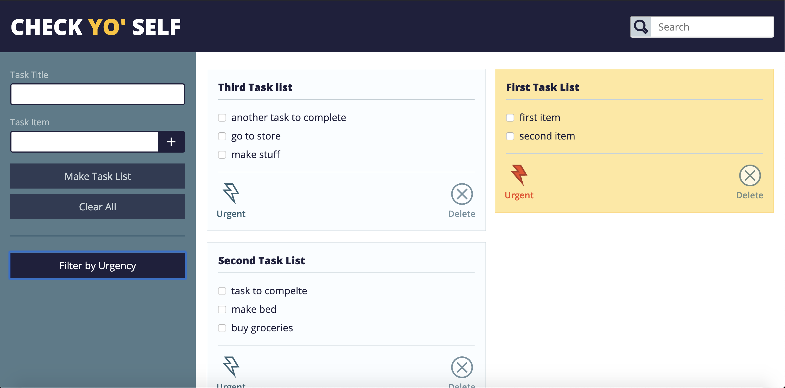
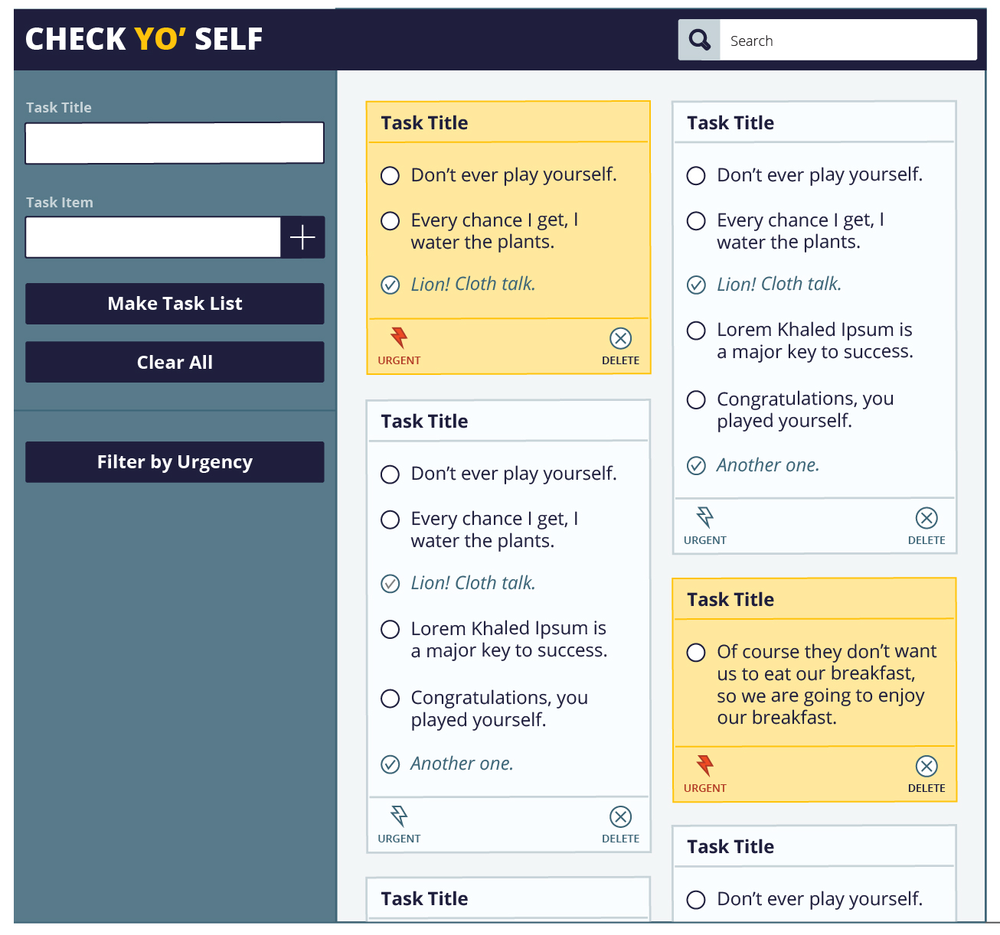

# CHECK YO' SELF

Check Yo' Self is a checklist application.  
[Project Details](https://frontend.turing.io/projects/module-1/check-yo-self-solo.html)

## Specification
Now that you’ve got the main foundations down to build out a front-end application, it’s time to prove to yourself that you own those skills! You’re going to be building a checklist application called Check Yo'Self!

## Learning Goals
Solidify and demonstrate your understanding of:
- Clean & organized CSS styles
- DRY JavaScript
- localStorage to persist data
- Iterate through/filter DOM elements using for loops
- Understand the difference between the data model and how the data is displayed on the DOM
- Ability to match/recreate a UI and create a great UX

## Technologies Used
This app made use of HTML, CSS, and Javascript. LocalStorage was also used to store and persist data after reloading the page.

## Screenshots
App Screenshot:
  

Comp Screenshot:  
  
